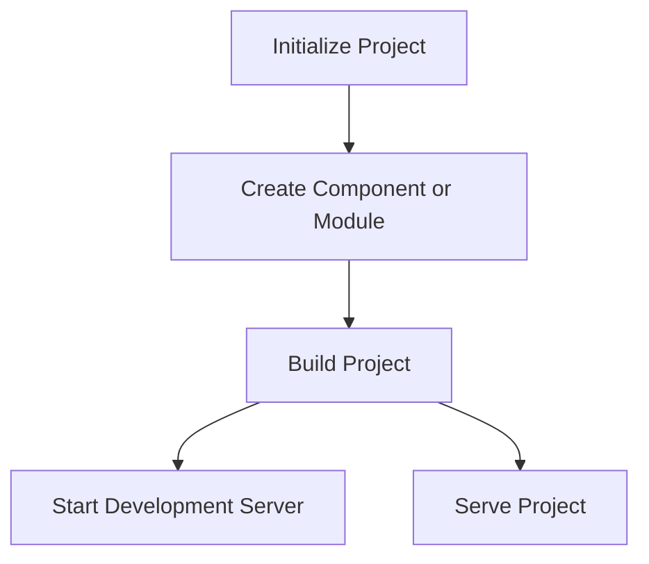

# Zero-Gen

Zero-Gen is a command-line tool designed to streamline the process of generating and managing components and modules in a project. It provides a set of commands to initialize a new project, create components or modules, build the project, and start development or production servers.

## Features

- Initialize a new project with a predefined structure
- Create new components or modules with ease
- Build the project for production
- Start a development server for live reloading
- Serve the project using an Express server

## Why Use Zero-Gen?

Zero-Gen simplifies the development process by providing a set of powerful commands to manage your project. It helps you to:

- Quickly set up a new project with a predefined structure
- Easily create and manage components and modules
- Streamline the build process for production
- Start a development server with live reloading for a better development experience
- Serve your project using an Express server for production

## Installation and Setup

To install Zero-Gen, you need to have Node.js and npm installed on your machine. You can install Zero-Gen globally using npm:

```sh
npm install -g zero-gen
```

## Usage

### General Usage

```sh
zero-gen [options] [command]
```

### Options

- `-V, --version`                   output the version number
- `-h, --help`                      display help for command

### Commands

#### `init <projectName>`

Initialize a new project.

Example:

```sh
zero-gen init my-project
```

#### `create [options] <type> <name>`

Create a new component or module.

Options:
- `-d, --desc <description>`  Add a description

Example:

```sh
zero-gen create component my-component -d "This is a new component"
zero-gen create module my-module -d "This is a new module"
```

#### `build <pluginName>`

Compile or package the project.

Example:

```sh
zero-gen build my-plugin
```

#### `start [options]`

Start the development server.

Options:
- `-p, --port <port>`  Specify port number (default: 3000)

Example:

```sh
zero-gen start -p 4000
```

#### `serve`

Start the express server to serve plugins.

Example:

```sh
zero-gen serve
```

## Use Cases

### Example 1: Initializing a New Project

To initialize a new project, use the `init` command:

```sh
zero-gen init my-new-project
```

This will create a new project with the necessary structure and files.

### Example 2: Creating a New Component

To create a new component, use the `create` command:

```sh
zero-gen create component my-component -d "This is a new component"
```

This will generate a new component with the specified name and description.

### Example 3: Building the Project

To build the project for production, use the `build` command:

```sh
zero-gen build my-plugin
```

This will compile and package the project for production.

### Example 4: Starting the Development Server

To start the development server with live reloading, use the `start` command:

```sh
zero-gen start -p 4000
```

This will start the development server on the specified port.

### Example 5: Serving the Project

To serve the project using an Express server, use the `serve` command:

```sh
zero-gen serve
```

This will start the Express server to serve the project.

## Dependencies

Zero-Gen relies on the following dependencies:

- `@types/node`: TypeScript definitions for Node.js
- `axios`: Promise-based HTTP client for the browser and Node.js
- `change-case`: A library for changing the case of strings
- `colorette`: A library for colorizing text in the terminal
- `commander`: A command-line interface library for Node.js
- `dotenv`: A library for loading environment variables from a `.env` file
- `form-data`: A library for creating readable "multipart/form-data" streams
- `handlebars`: A templating engine for JavaScript
- `open`: A library for opening files and URLs with the default application
- `prettier`: A code formatter
- `vite`: A build tool for modern web projects

## Contributing

We welcome contributions to Zero-Gen! If you have any ideas, suggestions, or bug reports, please open an issue or submit a pull request on GitHub.

### Guidelines

1. Fork the repository.
2. Create a new branch for your feature or bugfix.
3. Make your changes and commit them with clear and concise messages.
4. Push your changes to your forked repository.
5. Open a pull request to the main repository.

## License

Zero-Gen is licensed under the ISC License. See the LICENSE file for more details.

## Workflow Diagram


